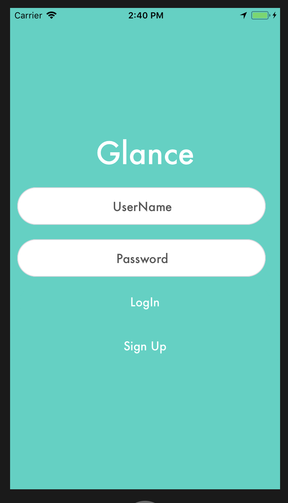
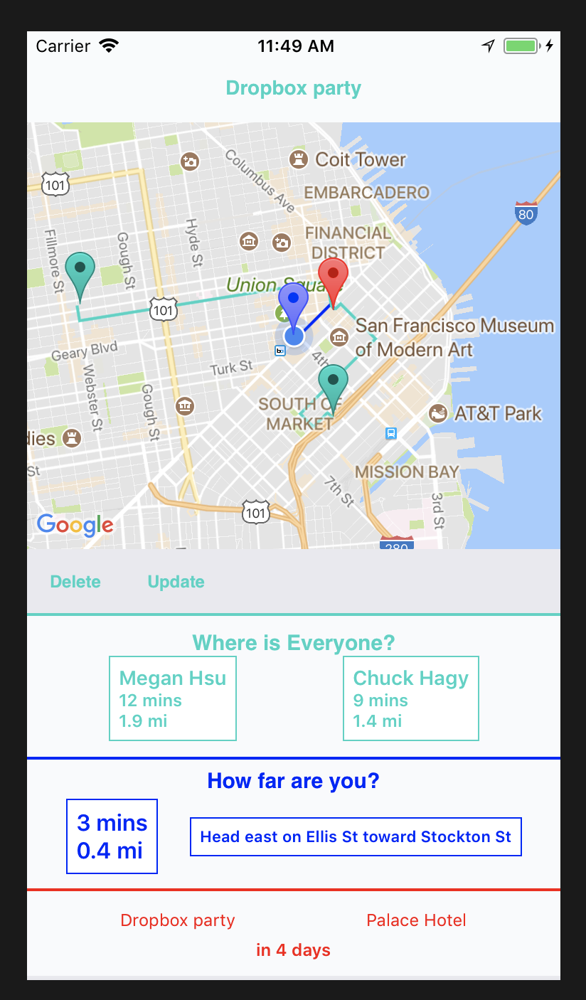
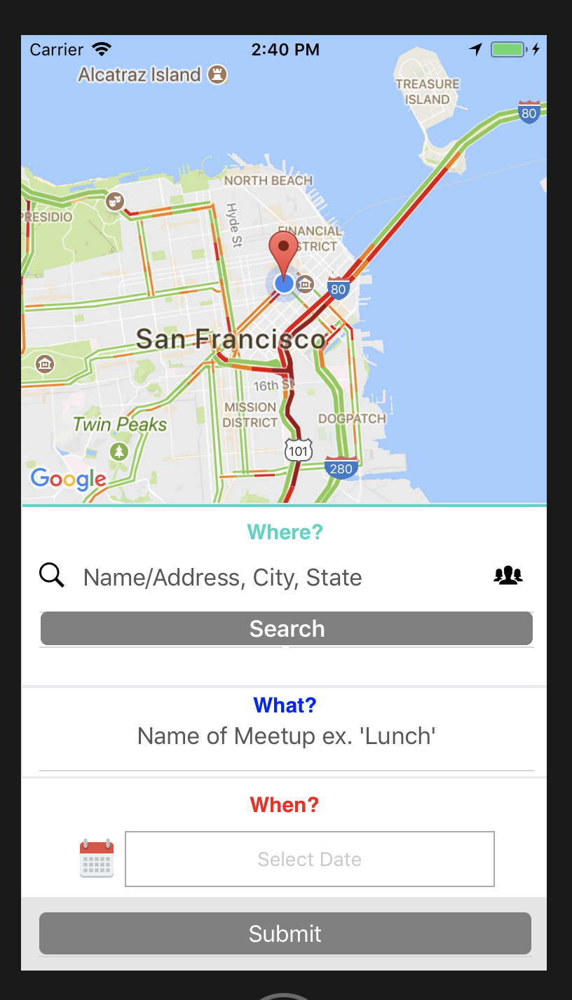

# Glance

Coordination platform for meetups and appointments by seeing other users’ locations.

- Built interactive frontend with JavaScript, ReactJS, React Native and native-base library with Redux, allowing users to create meetups by searching for locations and inviting friends to join.
- Architected and deployed RESTful API with Node.js and Express with data persistence using PostgreSQL DB; deployed backend to AWS using EC2 and Elastic Beanstalk.
- Implemented Google Maps, Google Directions, and Geocoding API’s and Socket.io to update locations in real time, allowing users to see exactly how far away friends are from destination.
- Used TDD with Jest and Enzyme for front end and supertests for REST API calls, achieving 80% code coverage.

## Technologies Used
- React.Js
- React Native
- JavaScript
- Redux
- Custom Styling
- Node/Express
- PostgresQL

## Create meetups and invite your friends.  For a short period of time before the meetup, you will be able to see everyones location and eta.  You can now decide when to leave the house based on when your friends actually get to the location.  You won't ever have to wait for that friend whos always late.

## Click on a meetup to see a map with everyones location.

## When you click on their names, it centers the map to their location.  Location updates in real time.

